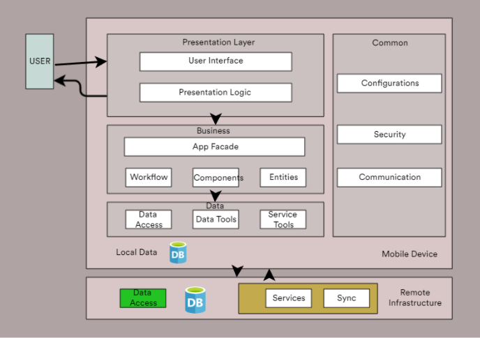
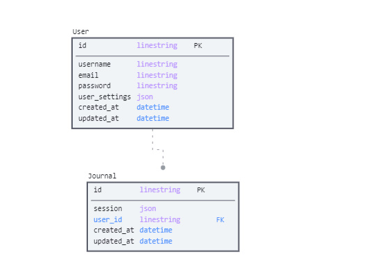
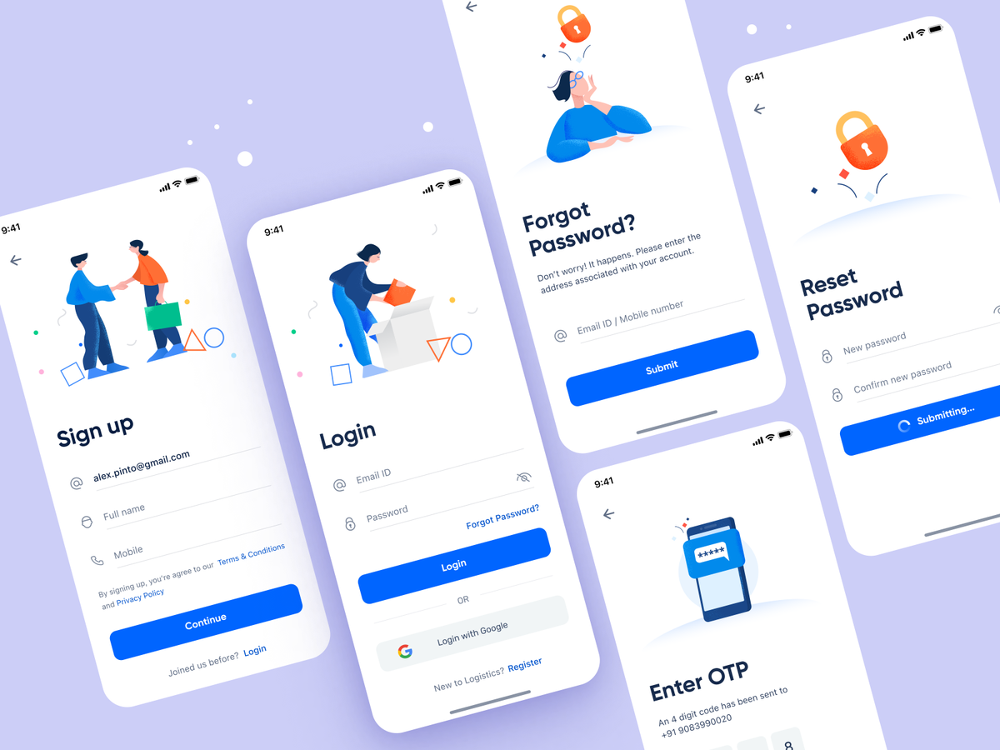
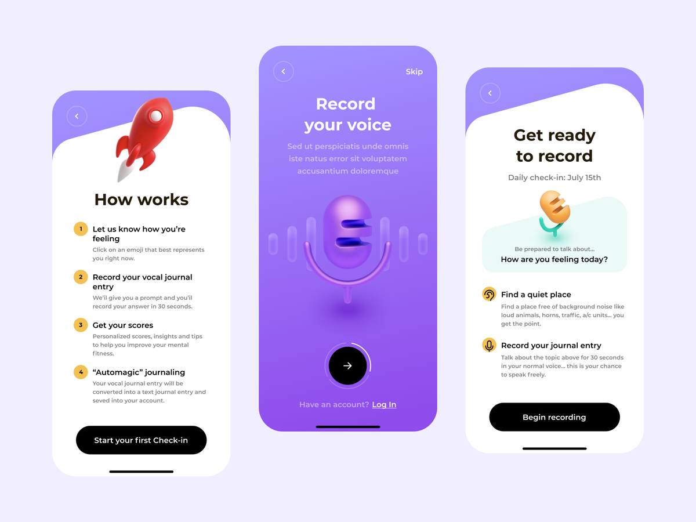
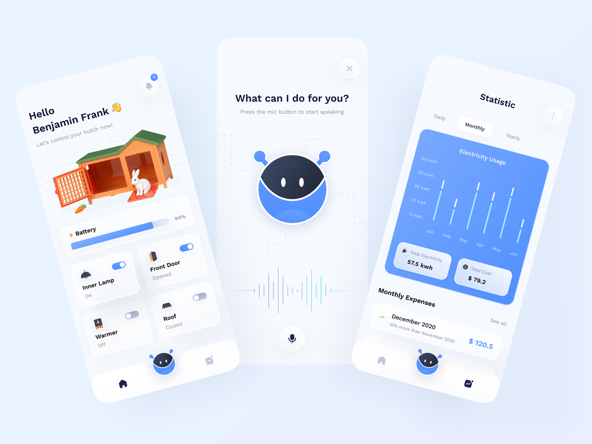

# Voice_Journalling_Assistant

A mobile-based journaling application, intended to address mental health issues by providing users with an opportunity to speak out about their challenges, while at the same time storing a journal of these events using speech to text technology

## MVP(Minimum Viable Product)

### Architecture

### User Stories

- As Tandiwe, a remote-based SEO writer, I want to have a conversation at the end of the day, so I can relief my mind of the rollercoaster of events that transpired.
- As Mwangi, a bachelor in Nairobi city, I want to journal my experience in dating, so I can see what might be going wrong or right in the experience.
- As Mohammed, a banking cyber security expert, I want assurance that my data is secure, so that I can avoid a leak of potentially sensitive information from my work journals
- As Simi, a consultant constantly travelling the world, I want to arrange my thoughts just before bed, so that I can wake up in the morning to sort out unresolved matters.
- As Samantha, a non-tech savvy individual, I need to be directed on how to create journals, so that I can start journaling on the application.
- As S’bu, a successful businessman, I want to easily login and access my consolidated thoughts, so that I can speed up my decision-making process.

### Data Modelling

### Mockups

#### Login/Auth Samples

#### Splash Screen Samples

#### App Conversation

## Authors

- [Elijah Daniel - Backend developer](https://github.com/ElijahDanie)
- [Edafe Oke - Mobile interface developer](https://github.com/edafeoke)
- [Njagi Ndungo - Documentation, Flutter & Speech Developer](https://github.com/enzonjagi)
